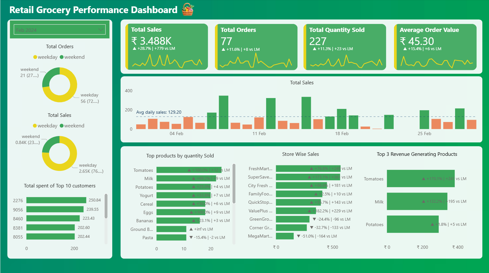

# Grocery Sales Analytics Dashboard

## Project Overview
This project analyzes sales data from a multi-location grocery store chain to uncover insights about **store performance, customer behavior, product demand, and seasonal sales trends**.

The analysis was performed using **SQL for data cleaning and exploration** and **Power BI for data visualization and dashboard development**.

---

## Business Objective
The objective of this project is to analyze grocery store sales data to identify patterns in **store performance, customer purchasing behavior, and product demand**.  
These insights can help businesses improve **inventory planning, marketing strategies, and overall sales performance**.

---

## Tools Used
- SQL – Data cleaning and exploratory analysis  
- Power BI – Data modeling and dashboard visualization  
- GitHub – Project documentation and version control  

---

## Dataset Information
- **Total Transactions:** 1,980  
- **Time Period:** August 2023 – August 2025  
- **Store Locations:** 9 grocery store branches  
- **Product Categories:** 11 aisles  
- **Products:** 18 grocery products  

The dataset includes transaction-level information such as customer ID, store name, product category, quantity purchased, pricing, discounts, and final transaction amount.

---

# Key Business Insights

## Store Performance
- **GreenGrocer Plaza** generates the highest revenue among all store locations, followed by **SuperSave Central** and **City Fresh Store**.
- These stores also demonstrate **more consistent monthly sales**, indicating stronger operational performance and customer traffic.

## Sales Distribution (Weekday vs Weekend)
- **Weekday sales contribute approximately 71% of total revenue**, significantly higher than weekend sales.
- This suggests that customers tend to complete most of their grocery shopping during weekdays.

## Customer Contribution
- Customers **2276, 9056, and 8460** are the top revenue-generating customers.
- Each contributes roughly **0.28% – 0.31% of total revenue**, showing the importance of repeat customers in overall sales.

## Seasonal Trends
- **March, October, and November** are the highest revenue-generating months within the dataset period.
- This indicates potential **seasonal demand patterns** that businesses can leverage for marketing and inventory planning.

## Product Demand
- **Chicken Breast, Tomatoes, and Potatoes** are the top-selling products by quantity.
- **Tomatoes show consistent demand across months**, suggesting it is a staple grocery item.

## Yearly Sales Comparison
- Sales performance in **2024 appears stronger than in 2025**, with several months in 2024 showing higher daily sales activity.

---

# Business Recommendations

- Maintain **higher inventory levels** for consistently high-demand products such as **Tomatoes, Potatoes, and Chicken Breast**.
- Analyze operational strategies used by **top-performing stores such as GreenGrocer Plaza** and replicate similar practices in lower-performing stores.
- Introduce **weekend promotions or discounts** to encourage more weekend purchases.
- Implement **loyalty programs or targeted offers** for high-value customers to increase repeat purchases.
- Plan **marketing campaigns and inventory planning** around high-demand months such as **March, October, and November**.

---

## Additional Recommendation (Weekend Strategy)

Since weekend sales are relatively lower compared to weekdays, the business could experiment with **expanding the product mix during weekends** by introducing items such as:

- Chips  
- Packaged snacks  
- Ready-to-eat products  

These products are commonly associated with **weekend consumption** and may encourage impulse purchases, helping increase **customer spending and weekend revenue**.

---

## Dashboard Preview

---

## Project Structure
